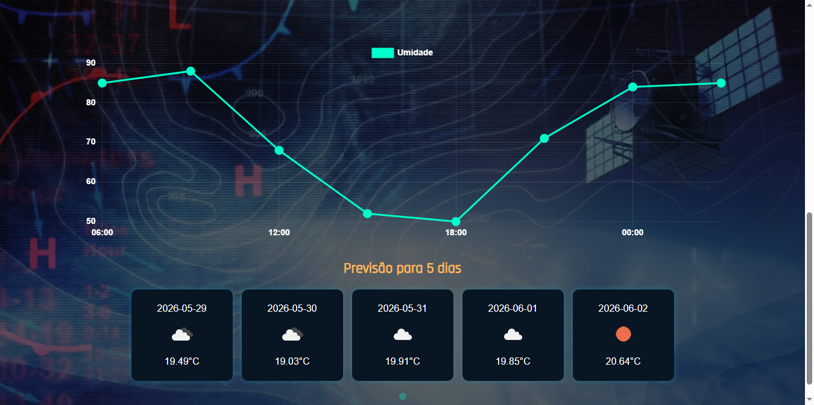

# Weather Control Panel

Um painel de controle meteorológico interativo construído com Flask, que exibe informações climáticas em tempo real usando a API OpenWeatherMap.

## Preview



## Funcionalidades

- **Consulta por Cidade**: Digite o nome de qualquer cidade para obter informações meteorológicas
- **Dados em Tempo Real**: Temperatura atual, umidade e condição climática
- **Gráficos Interativos**: Visualização de temperatura e umidade usando Chart.js
- **Previsão de 5 Dias**: Previsão meteorológica para os próximos 5 dias
- **Interface em Português**: Totalmente traduzido para português brasileiro
- **WebSocket**: Comunicação em tempo real para atualizações rápidas

## Tecnologias

- **Backend**: Flask (Python)
- **Frontend**: HTML, CSS, JavaScript
- **WebSocket**: Flask-Sock
- **Gráficos**: Chart.js
- **API**: OpenWeatherMap

## Pre-requisitos

- Python 3.8+
- Chave da API OpenWeatherMap

## Instalacao

1. Clone o repositório:

```bash
git clone https://github.com/mariac1995/WEATHER--CONTROL--PAINEL.git
cd WEATHER--CONTROL--PAINEL
```

2. Crie um ambiente virtual (opcional mas recomendado):

```bash
python -m venv .venv
source venv/bin/activate  # Linux/Mac
# ou
venv\Scripts\activate  # Windows
```

3. Instale as dependências:

```bash
pip install -r requirements.txt
```

4. Configure a chave da OpenWeatherMap:

Crie um arquivo chamado `.env` na raiz do projeto e adicione sua chave:

```env
OPENWEATHER_API_KEY=sua_chave_aqui
```

Voce pode usar o arquivo `.env.example` como modelo. O arquivo `.env` fica apenas na sua maquina e nao deve ser enviado para o GitHub.

5. Execute o aplicativo:

```bash
python app.py
```

6. Abra o navegador e va para:

```
http://127.0.0.1:5000
```

## Estrutura do Projeto

```
weather-control-painel/
├── app.py                 # Aplicativo principal Flask
├── index.html             # Pagina principal
├── requirements.txt       # Dependências Python
├── .env.example           # Modelo das variaveis de ambiente
└── static/
    ├── style.css         # Estilos CSS
    ├── script.js         # JavaScript do frontend
    └── images/           # Imagens
```

## Configuracao

A chave da OpenWeatherMap deve ser configurada por variavel de ambiente, para evitar que ela fique exposta no codigo.

1. Obtenha uma chave gratuita em: https://openweathermap.org/api
2. Crie um arquivo `.env` na raiz do projeto
3. Adicione a variavel:

```env
OPENWEATHER_API_KEY=sua_chave_aqui
```

O arquivo `.env` esta no `.gitignore`, entao ele nao sera enviado para o repositorio. Envie apenas o `.env.example`, que serve como exemplo sem conter a chave real.

## Como Usar

1. Na página inicial, digite o nome de uma cidade no campo de busca
2. Pressione Enter ou aguarde a consulta automática
3. Visualize os dados meteorológicos atuais
4. Observe os gráficos de temperatura e umidade
5. Veja a previsão para os próximos 5 dias

## Licenca

Este projeto é apenas para fins educacionais.

## Autor

Maria C.
